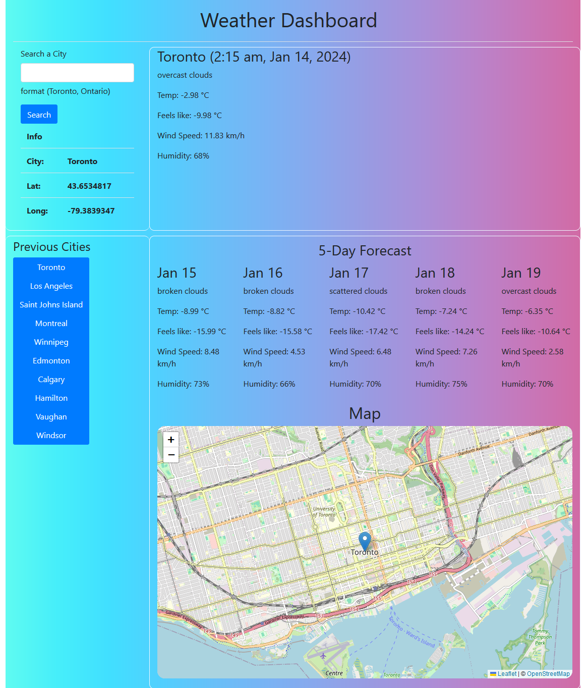

# Server-Side API: Weather Dashboard

The server-side API - Weather Dashboard web application was created to allow the user to search a city name and get its current and five-day forecast. Also, it provides links on the page to previously searched cities that will change the weather info once a button is clicked. 

## Features

- Server-side API: Open Street Map used to get the city long, lat coordinates from the searched city.
- Server-side API: Open Weather Map used to get the a city's current and five-day forecast using its coordinates.
- Server-side API: Leaflets used to display a map box with centering and a marker on the city coordinates.

 

## Appendix

https://openweathermap.org/current

https://openweathermap.org/forecast5

https://leafletjs.com/reference.html

## Authors

- [Syed Kazmi](https://github.com/kazmiali123)

## Deployment

GitHub Repository: https://github.com/kazmiali123/Challange6-Server-side-API-Weather-Dashboard.git

## Demo

